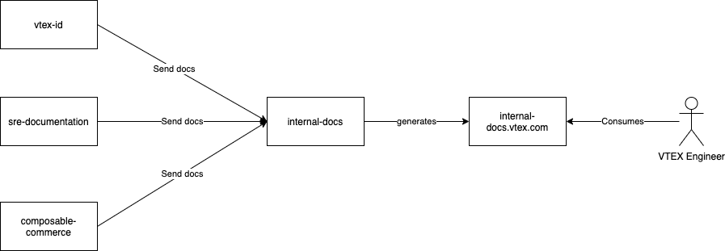

# VTEX Internal Docs

VTEX Internal Docs is an internal documentation solution that enables teams to collaborate seamlessly by having internal documentation distributed across multiple repos and rendered in a beautiful documentation portal available for all VTEX employees that have a github user in the `vtex` organization.

If you have any questions, reach out to us at #internal-docs.

## Benefits

- A single place for all VTEX internal documentation: no more looking for docs at notion or github wikis, go to a single place and find all your internal docs needs.
- Find what you need easily: VTEX Internal Docs search works!
- Keep your docs close to your code: no need to open separate Pull requests in other repos to document your systems.


## Architecture

VTEX Internal Docs is supposed to be used with a github workflow in order to send data from a github repo to `vtex/internal-docs` repo.

This workflow needs a token with write access to the `vtex/internal-docs` repo.

At any push to branches `main` or `master`, the workflow will grab all documentation inside `docs/` folder of your repo and will send it to the subfolder that you define on `docs-product` variable of the workflow.



## How to Use

1. Create a folder called `.github/workflows` in the root of your repo, if it doesn't already exists.

2. Create a workflow inside this repo, for example `internal-docs.yml`

3. Fill the workflow with the following yml file. Don't forget to change the `docs-product` variable.

```yml
name: "Internal Docs Integration"
on:
  push:
    branches:
      - master
      - main

jobs:
  build:
    runs-on: ubuntu-latest

    steps:
      - uses: actions/checkout@v2
      - uses: vtex/action-internal-docs@main
        with:
          repo-token: ${{ secrets.VTEX_GITHUB_BOT_TOKEN }}
          docs-product: {YOUR_TEAM_NAME_HERE, e.g. Identity, Cloud-Services}
```

4. Ask the SRE team in #team-sre to setup pachamama's bot token in your repo. This will be needed because pachamama has write access to `vtex/internal-docs`. Soon this step won't be needed as we will use organization secrets instead.

5. From now on, every push on branches `master` or `main` will sync your files in the `docs/` folder to the `vtex/internal-docs` repo and it will be made available on `https://internal-docs.vtex.com/`

## Contributing

If you want to contribute, check out [contributing](./CONTRIBUTING.MD) and the [internal docs action](https://github.com/vtex/action-internal-docs)
